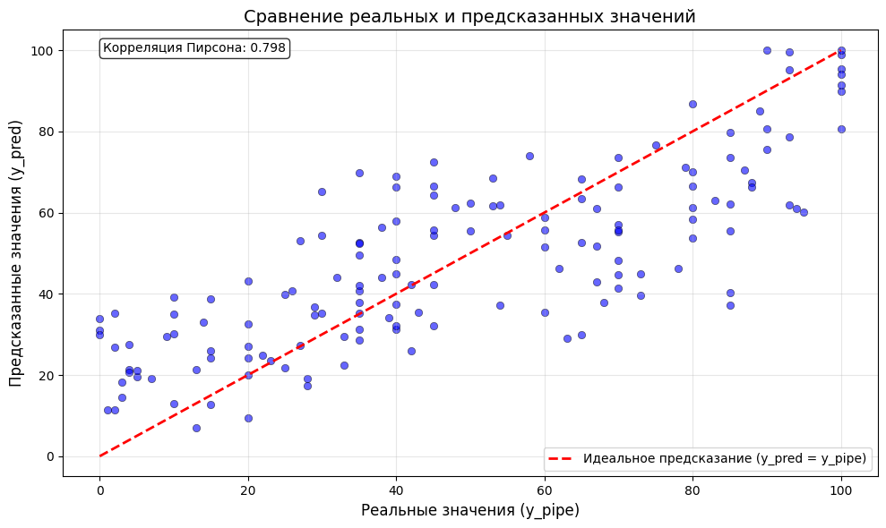
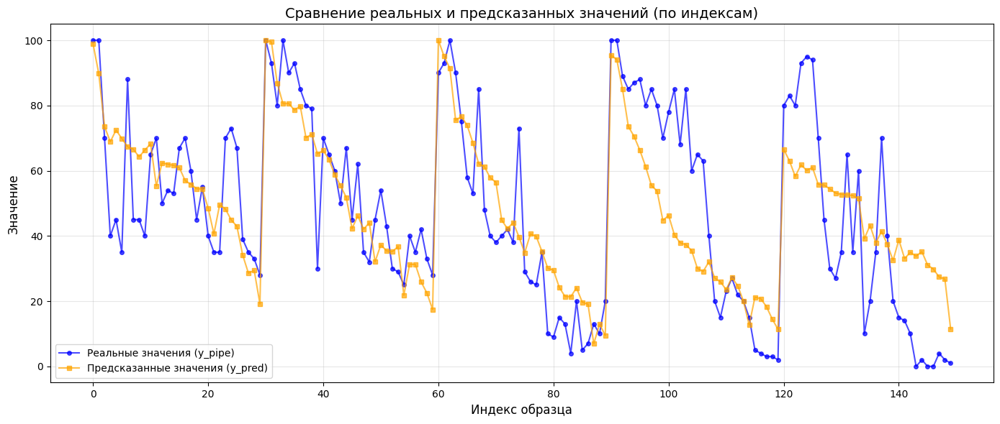
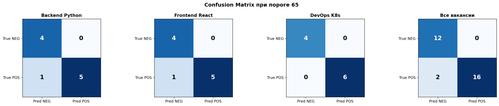
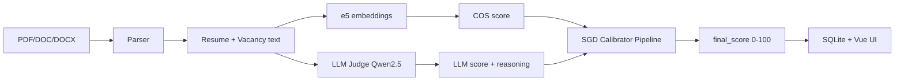

## Проект: Resume Matcher — подбор кандидатов под вакансию

**Команда 3:** Андрей Гузнищев, Иван Яковлев, Игорь Шайдеров, Станислав Хрускин.
**Репозиторий** `resume-matcher` (монорепозиторий, основная ветка `main`)  

---

Была озвучена задача - создание прототипа системы автоматического поиска и ранжирования кандидатов на основе соотеветствия требованиям вакансии.
В требованиях была озвучена необходимость кратких пояснений почему подходит кандидат или нет. Для решения этой задачи был реализован прототип сервиса матчинга резюме и вакансий на основе гибридного скоринга.
Стек - Python 3, Flask, Vue 3, SQLite, sentence-transformers, vLLM. Данные технологии были выбран на основе требований и навыков команды.

По итогам мозгового штурма рассматривались разные варианты, но наиболее оптимальной была была призанна следующая схема пайплайна: 
1. Парсинг документов (резюме и вакансии)
2. Эмбеддинги
3. LLM-судья(Qwen 2.5)
4. Калибровка результатов
5. Сохранение в БД итогов

Каждая вакансия оценивалась по следующему шаблону - 

1. **Семантика:** `intfloat/e5-large-v2`, cosine similarity (query/passage).
2. **LLM-судья:** OpenAI-совместимый endpoint (`VLLM_URL`), JSON с `score` и `reasoning`.
3. **Калибратор:** sklearn Pipeline (кастомный трансформер признаков + масштабирование + SGDRegressor), обучен на ручной разметке.
4. **Fallback:** при ошибке модели — линейная формула `0.4 × COS + 0.6 × LLM`.

Базово мы планировали получать оценки от семантического сходства и LLM-судьи, умножать их на 0.4 и 0.6, а затем суммировать в итоговое значение. Практика и прогоны показали что такой подход не совсем корректный и были проведены эскперименты по подбору подходящих параметров. Для этого был сформирован и  размечен учебный датасет из 150 пар с ручной оценкой релевантности (0–100). Для каждой пары собраны признаки: `list_score_llm`, `list_score_cos`, `list_score_manual`, производный `llm_cos_interaction`, были обучены ряд моделей и выбрана наилучщая модель для калибровки результатов(**SGDRegressor** (R² ≈ 0,65 на кросс-валидации)). Разметка и статистика зафиксированы в ноутбуке `Resumematcher.ipynb` и в `README.md`.

**Статистически данные датасета**
```
        list_score_llm	list_score_cos	list_score_manual	llm_cos_interaction
count	150.000000	    150.000000	    150.000000	        150.000000
mean	72.726667	    0.840847	    48.520000	        61.289187
std	    15.710851	    0.024402	    29.589296	        13.915949
min	    20.000000	    0.796700	    0.000000	        16.100000
max	    95.000000	    0.902400	    100.000000	        85.386000

Модель калибратора 

Опробованы 10 вариантов, различных алгоритмов 

СРАВНЕНИЕ ВСЕХ МОДЕЛЕЙ (10 вариантов) по результатам кросс валидации :


LinearRegression     | R² = 0.5872
Ridge                | R² = 0.5873
Lasso                | R² = 0.5872
ElasticNet           | R² = 0.5871
BayesianRidge        | R² = 0.5869
HuberRegressor       | R² = 0.5844
SGDRegressor         | R² = 0.6454
RandomForest         | R² = 0.6181
SVR                  | R² = 0.5773
LinearSVR            | R² = 0.5880


 РЕЙТИНГ МОДЕЛЕЙ ПО КАЧЕСТВУ:

1. SGDRegressor         | R² = 0.6454
2. RandomForest         | R² = 0.6181
3. LinearSVR            | R² = 0.5880
4. Ridge                | R² = 0.5873
5. Lasso                | R² = 0.5872
6. LinearRegression     | R² = 0.5872
7. ElasticNet           | R² = 0.5871
8. BayesianRidge        | R² = 0.5869
9. HuberRegressor       | R² = 0.5844
10. SVR                 | R² = 0.5773


```
В качестве калибратора выбран SGDRegressor. 1. SGDRegressor   R² = 0.6454





На графиках сравнения отчётливо видно, что нам удалось добиться решить главное. С помощью калибровки повторять тренд экспертной(ручной разметки) выводить вперёд по ранжированию подходящих кандидатов и отсекать однозначно не подходящих. Это подверждается изображением ниже основанном на тестовой выборке, хоть она и не объёмна.

- `Resumematcher.ipynb` файл содержит пайплайн обучения модели, основные метрики вывод, данные ручной разметки, создания бинарного файла модели калибратора.

- `packages/api/custom_transformers.py` специализированный  класс для расширения признакового пространства данных. Необходим для работы бинарного предстваления модели SGDregressor.
 
- `packages/api/model_best_resume_matcher.pkl` бинарник  обученный pipline для калибровки finalscore . Включает в себя изменение признакового пространства, масштабирование и саму модель SGDRegressor.

- `resume_train` папка содежит резюме на которых обучалась модель

- `vacancy_train` папка содержит вакансии на которых обучалась модель

- `images` папка с сохранёными графиками

- `vacancy_test` папка содержит тестовый набор вакансиий

- `resume_test` папка содержит тестовый набор резюме

- `Full_manual_marking_train_df.csv` файл содержит уже полученные данные, на котором обучалась модель для finall_score

- `Manual_labeling_of_the_test_dataset.docx` файл ручной разметки тестового набора данных

- `Manual_labeling_of_the_train_dataset.docx` файл ручной разметки тренировочного набора данных

Итогом стало около улучшения оценок, прототип на проверочном наборе данных показал следующие показатели:
##### Метрики по вакансиям (порог 65)

| Вакансия | Recall | Precision | F1 | TP | FP | FN | TN |
| :--- | ---: | ---: | ---: | ---: | ---: | ---: | ---: |
| Backend Python | 0.833 | 1.0 | 0.909 | 5 | 0 | 1 | 4 |
| Frontend React | 0.833 | 1.0 | 0.909 | 5 | 0 | 1 | 4 |
| DevOps K8s | 1.000 | 1.0 | 1.000 | 6 | 0 | 0 | 4 |

Мы ислледовали разные пороги годности кандидата, преследую цели максимально отсеять не пожходящих кандидатов, результаты
исследования и целевой порог 80 - оказался слишком жестким, поэтому мы нашли баланс между жесткостью и объемом работы.



Общая структура и архитектура прототипа - 
- Flask-приложение с CORS, Flasgger (Swagger).
- Парсинг PDF / DOC / DOCX, SQLite (резюме, вакансии, анализы).
- Эндпоинты: upload, batch-upload, predict, batch-predict.
- Vue 3 + Vite + Element Plus + Pinia.



Основной путь пользователя - логин, загрузка одного/нескольких резюме и вакансий, далее predict, итогом работы предсказанием является таблица результатов с сортировкой по score(чем выше, тем лучше совпадает) с кратким комментарием внутри.

Проект находится в состоянии deploy-ready  и использует три докер образа, запускается docker-compose файлом.
**Демо (локально):**

- API: `http://localhost:5001`
- Swagger: `http://localhost:5001/apidocs/`
- UI: `http://localhost:8080`

**Дальнейшие улучшения:**
- Накопление большего объёма размеченных данных (цель: 1000+ пар)
- Эксперименты с нелинейными моделями 
- Расширение признакового пространства
- Внедрение онлайн-дообучения по мере поступления новых экспертных оценок
- Не использовать одну универсальную ML-модель для всех вакансий, а обучать отдельный калибратор для каждой экспертной области (IT, маркетинг, финансы, производство и т.д.). Не использовать одну универсальную ML-модель для всех вакансий, а обучать отдельный калибратор для каждой экспертной области (IT, маркетинг, финансы, производство и т.д.). Активация экспертного калибратора проводить по семантической связи с доменной областью.

```
Аспект	        Универсальный калибратор	Экспертно-областной
Точность	    Средняя	                    Высокая (специализация)
Данные	        Нужно много (150+)	        Меньше на область (50-100)
Интерпретация	Общая	                    Понятная для экспертов
Масштабирование	Сложно (одна модель)	    Легко (добавляем новые области)
```
