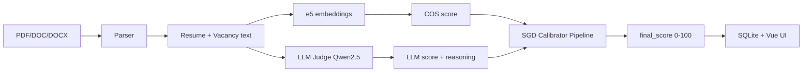

# Записка о ходе и результатах работы

## Проект: Resume Matcher — подбор кандидатов под вакансию

**Команда:** Андрей Гузнищев, Иван Яковлев, Игорь Шайдеров, Станислав Хрускин.
**Репозиторий** `resume-matcher` (монорепозиторий, основная ветка `main`)  

---

## 1. Краткое резюме
Была озвучена задача - создание прототипа системы автоматического поиска и ранжирования кандидатов на основе соотеветствия требованиям вакансии.
В требованиях была озвучена необходимость кратких пояснений почему подходит кандидат или нет. Для решения этой задачи был реализован прототип сервиса матчинга резюме и вакансий на основе гибридного скоринга.
Стек - Python 3, Flask, Vue 3, SQLite, sentence-transformers, vLLM. Данные технологии были выбран на основе требований и навыков команды.

По итогам мозгового штурма рассматривались разные варианты, но наиболее оптимальной была была призанна следующая схема пайплайна: 
1. Парсинг документов (резюме и вакансии)
2. Эмбеддинги
3. LLM-судья(Qwen 2.5)
4. Калибровка результатов
5. Сохранение в БД итогов

Каждая вакансия оценивалась по следующему шаблону - 

1. **Семантика:** `intfloat/e5-large-v2`, cosine similarity (query/passage).
2. **LLM-судья:** OpenAI-совместимый endpoint (`VLLM_URL`), JSON с `score` и `reasoning`.
3. **Калибратор:** sklearn Pipeline (кастомный трансформер признаков + масштабирование + SGDRegressor), обучен на ручной разметке.
4. **Fallback:** при ошибке модели — линейная формула `0.4 × COS + 0.6 × LLM`.

Базово мы планировали получать оценки от семантического сходства и LLM-судьи, умножать их на 0.4 и 0.6, а затем суммировать в итоговое значение. Практика и прогоны показали что такой подход не совсем корректный и были проведены эскперименты по подбору подходящих параметров. Для этого был сформирован и  размечен учебный датасет из 150 пар с ручной оценкой релевантности (0–100). Для каждой пары собраны признаки: `list_score_llm`, `list_score_cos`, `list_score_manual`, производный `llm_cos_interaction`, были обучены ряд моделей и выбрана наилучщая модель для калибровки результатов(**SGDRegressor** (R² ≈ 0,65 на кросс-валидации)). Разметка и статистика зафиксированы в ноутбуке `Resumematcher.ipynb` и в `README.md`.
Итогом стало около улучшения оценок, прототип на проверочном наборе данных показал *ЗДЕСЬ ПИШЕМ ПРО МЕТРИКИ*

Общая структура и архитектура прототипа - 
- Flask-приложение с CORS, Flasgger (Swagger).
- Парсинг PDF / DOC / DOCX, SQLite (резюме, вакансии, анализы).
- Эндпоинты: upload, batch-upload, predict, batch-predict.
- Vue 3 + Vite + Element Plus + Pinia.

Основной путь пользователя - логин, загрузка одного/нескольких резюме и вакансий, далее predict, итогом работы предсказанием является таблица результатов с сортировкой по score(чем выше, тем лучше совпадает) с кратким комментарием внутри.

Проект находится в состоянии deploy-ready  и использует три докер образа, запускается docker-compose файлом.
**Демо (локально):**

- API: `http://localhost:5001`
- Swagger: `http://localhost:5001/apidocs/`
- UI: `http://localhost:8080`